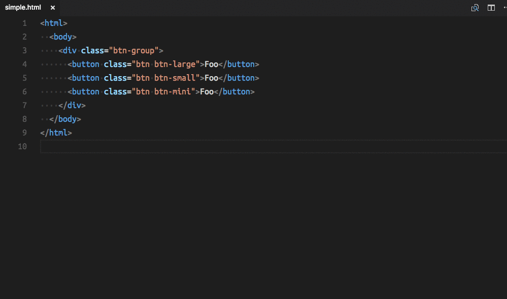

Mockup Converter
================

So you have your [Bootstrap mockups](https://v4-alpha.getbootstrap.com/) in hand and now you want to make an awesome application based on [reactstrap]() components. But now you realize you are going to need to hand translate the class names in your mockups into props on your components.

```html
<button class="btn btn-large">OK!</button>
```

Needs to become:

```jsx
import { Button, } from 'reactstrap';

render() {
  return (
    <Button size="lg">OK!</Button>
  );
}
```

What a hassle! So let's fix that with `mockup-converter`. Simply install it:

```
$ npm install mockup-converter -g
```

And either run it on your file:

```
$ mockup-converter mymockup.html
```

Or run it through STDIN to `mockup-converter`:

```
$ cat mymockup.html | mockup-converter
```

Which means you can do cool things like running it through the [FilterText](https://github.com/yhirose/vscode-filtertext) extension in VSCode.



# What does this handle?

Most of the bootstrap classes are mapped. A few big things, like Media and Carousel aren't in there. But what's in there will get you far down the road really quickly.

# Classname passthrough

Any class name it doesn't recognize will be passed through, so:

```html
<div class="my-custom-class">Hey now!</div>
```

Becomes:

```jsx
<div className="my-custom-class">Hey now!</div>
```

And

```html
<button class="btn btn-large foo">OK!</button>
```

Becomes:

```jsx
<Button size="lg" className="foo">OK!</Button>
```

# Style handling

Styles are also broken into their react versions automagically:

```html
<div style="margin-top: 50px;padding: 5px; line-height: 2em;">
```

Becomes:

```jsx
<div style={{marginTop: 50, padding: 5, lineHeight: '2em'}}>
```

Yeah... It does that too. So honestly, it's cool to use this even if you aren't using Bootstrap or reactstrap.
